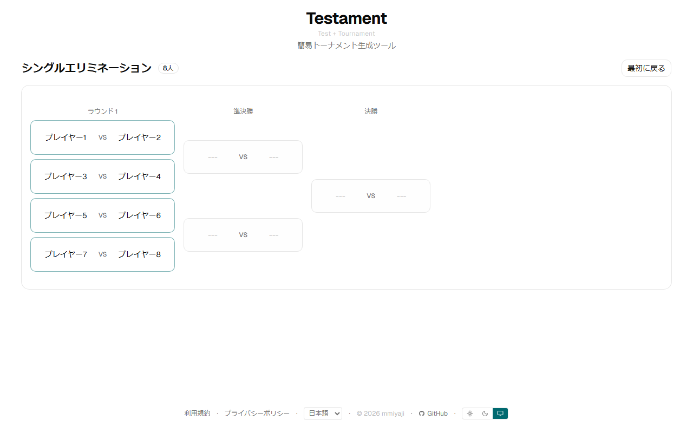
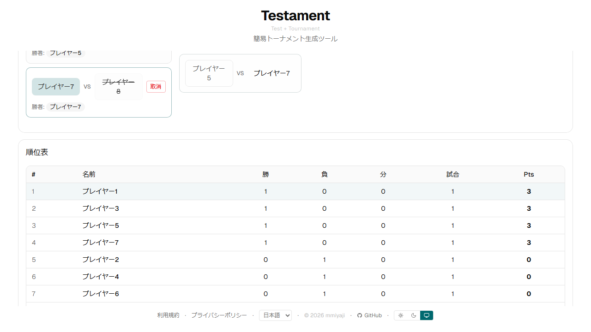
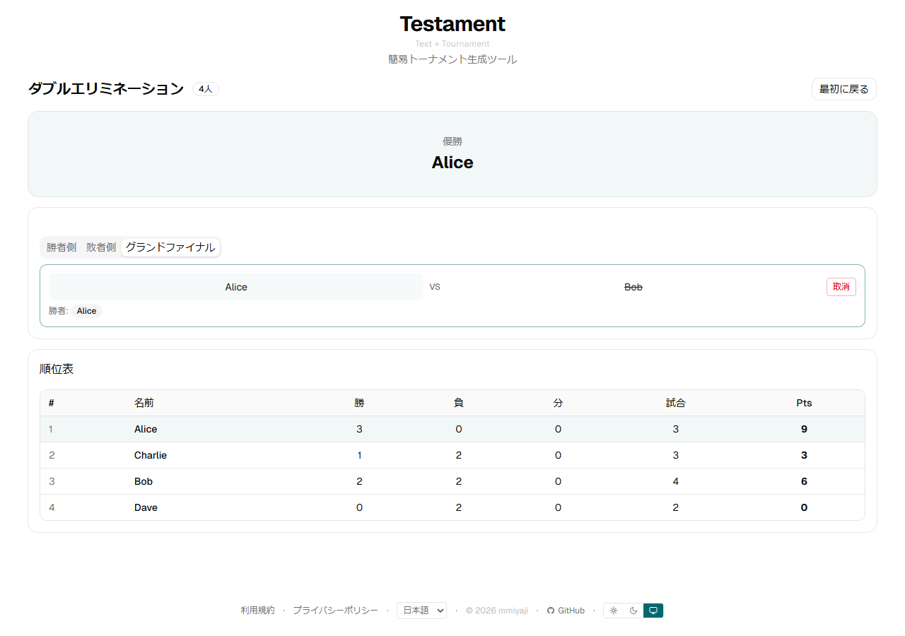

# Testament

**https://mmiyaji.github.io/testament/**

シンプルなトーナメント生成ツールです。

> **Test** + **Tournament** = **Testament**

## スクリーンショット

### シングルエリミネーション


### 進行中・順位表


### ダブルエリミネーション（優勝）


## 対応形式

| 形式 | 説明 |
|------|------|
| シングルエリミネーション | 負けたら即敗退 |
| ダブルエリミネーション | 2敗で敗退（敗者復活あり） |
| ラウンドロビン（総当り） | 全員が全員と対戦 |
| スイス式 | 同成績同士でマッチング |
| とことん対戦 | 試合数均等・連戦回避で無限に続行 |

## 機能

- 日本語 / English 対応
- ライト / ダーク / 自動テーマ
- 同名参加者の自動区別（`[1]`, `[2]`...）
- 対戦台数設定・動的変更（とことん対戦）
- 結果の取消
- 順位表

## 開発

```bash
npm install
npm run dev
```

## テスト

```bash
npx playwright test
```

## ライセンス

[MIT](LICENSE)

## ビルド・デプロイ

`main` ブランチへのプッシュで GitHub Actions が自動ビルド・デプロイします。

```bash
npm run build
```
